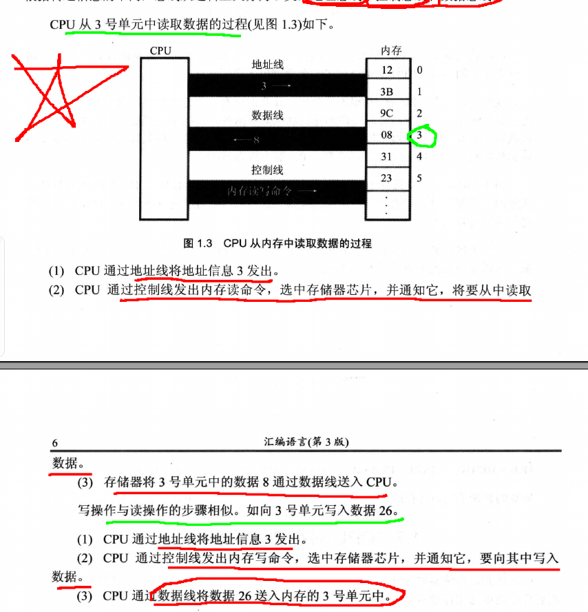

## 第一章 基础知识

### 1.1 机器语言

即0101，每一种微处理器由于硬件设计和内部结构的不同，就需要不同的电平脉冲控制其工作；

每一种微处理器都有自己的机器指令，即机器语言；

### 1.2 汇编语言的产生

由于0101太难记，并且太容易写错，且难以排错，所以产生了汇编；

例如将寄存器BX的内容放入AX中：

-   机器指令：1000100111011110
-   汇编：mov ax,bx

但是计算机只懂0101，所以需要将汇编转为机器指令的翻译程序，即：**编译器**；

程序员写汇编，由汇编器编译为机器码给计算机执行；

### 1.3 汇编语言组成

汇编语言目前有三类指令：

-   **汇编指令：机器码的助记符；**
-   **伪指令：没有对应的机器码，由编译器执行，主要帮助编译器理解；**
-   **其他符号：如+、-、*、/等，由编译器识别；**

### 1.4 存储器

存储器包括内存和磁盘等设备；

要想让CPU工作，必须向其提供指令和数据；

指令和数据本质上都是二进制，CPU会直接和内存交互、而磁盘中的数据需要先读入内存才能被处理；

### 1.7 CPU对存储器的读写

CPU要对内存进行读写，首先要**指定存储单元地址**；同时，由于存在多种存储器件，所以还要**指定CPU对哪个器件进行操作**，以及进行**哪种操作**；

即：

-   地址信息：存储单元的地址；
-   控制信息：器件的选择，读或者写的命令；
-   数据信息：读或者写的数据；

CPU通过总线和其他芯片交互，包括：

-   地址总线；
-   控制总线；
-   数据总线；

读写数据的过程如下图所示：

### 1.8 地址总线

CPU通过地址总线来指定存储单元；

**所以地址总线的大小决定了CPU能够对多少个存储单元进行寻址和操作；**

若一个CPU具有N根地址线，则可以说地址总线的宽度为N，此时最多可寻址2^N个地址；

### 1.9 数据总线

CPU与其他存储器件通过数据总线进行数据传输；

**数据总线的宽度决定了CPU与外界数据的传输速度；**

8根数据总线一次可以传输8位，而64根数据总线一次可以传输8个字节；

### 1.10 控制总线

CPU对外部器件的控制是通过控制总线进行的；

**控制总线的宽度决定了CPU对外部器件的控制能力**

### 监测点 1.1

#### 问题

（1） 1个CPU的寻址能力为8KB，那么他的地址总线的宽度为【 】。

（2） 1KB的存储器有 【 】个存储单元。存储单元编号从【 】到【 】。

（3） 1KB的存储器可以存储【 】个bit，【 】个Byte。

（4） 1GB、1MB、1KB分别是【 】Byte。

（5） 8080、8088、8026、80386的地址总线宽度分别为16根、20根、24根、32根，则他们的寻址能力分别为：【 】(KB)、【 】(MB)、【 】(MB)、【 】(GB)。

（6） 8080、8088、8086、8026、80386的数据总线宽度分别为8根、8根、16根、16根、32根。则它们一次可以传送的数据为：【 】(B)、【 】(B)、【 】(B)、【 】(B)、【 】(B)。

（7） 从内存中读取1024字节的数据，8086至少要读【 】次，80386至少要读【 】次。

（8）在存储器中，数据和程序以【 】形式存放。

#### 答案

（1）由于8Kb = 2^13 bit，所以宽度为：13；

（2）一个存储单元为一个字节，即1Byte，1Kb = 1024Byte，所以有1024个单元，编号为0~1023；

（3）1024 x 8bit，1024Byte；

（4）1GB、1MB、1KB分别是【**1024x1024x1024、1024x1024、1024** 】Byte；

（5）2^16 = 2 ^ 6 x 1024 = 64KB、2^20 = 1024 x 1024 = 1MB、2^24 = 2^4 x 1024 x 1024 = 16MB、2^32 = 2^2 x 1024 x 1024 x 1024 = 4GB；

（6）它们一次可以传送的数据为：【 **1** 】(B)、【 **1** 】(B)、【 **2** 】(B)、【 **2** 】(B)、【 **4** 】(B)；

（7）8086数据总线为2Byte，所以需要读1024 / 2 = 512次、而80386为4Byte，所以需要读1024/4 = 256次；

（8）在存储器中，数据和程序以【 **二进制码** 】形式存放；

